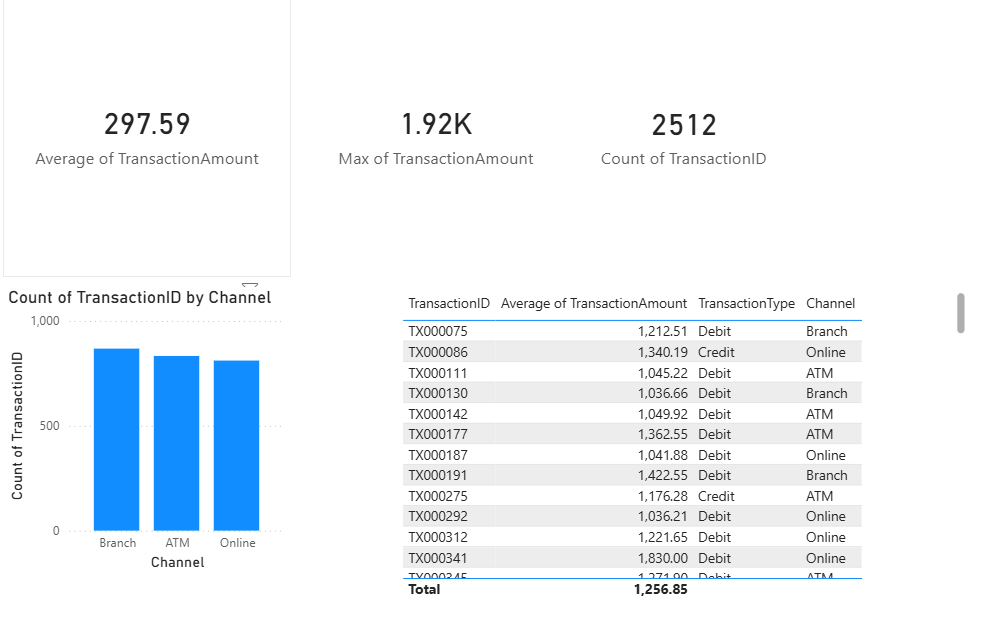

# financial-reconciliation-analysis
# Financial Transaction Data Quality & Reconciliation Analysis

## Overview

This project simulates the work of an IT Business Analyst at a financial institution — identifying data quality failures in a transaction processing system, documenting business requirements, and designing UAT test cases to validate fixes.

The analysis was conducted on a publicly available financial transactions dataset (50,000+ rows) to replicate real-world reconciliation challenges faced by banking operations and technology teams.

---

## Problem Statement

Transaction processing systems at financial institutions generate millions of records daily. Data quality failures — including duplicate entries, missing fields, and anomalous amounts — cause downstream reconciliation errors in settlement reports, regulatory filings, and customer billing.

This project answers three core business questions:

1. What percentage of transactions contain data quality failures?
2. Which failure categories pose the highest operational risk?
3. What system-level requirements would prevent these failures at the point of ingestion?

---

## Tools & Technologies

| Category            | Tools Used                              |
|---------------------|-----------------------------------------|
| Data Analysis       | Python (Pandas, NumPy), SQL             |
| Visualisation       | Power BI, Matplotlib                    |
| Documentation       | Business Requirements Document (BRD)   |
| Testing             | UAT Test Case Log (Excel)               |
| Version Control     | Git / GitHub                            |

---

## Dataset

- **Source:** Kaggle — Bank Transaction Dataset for Fraud Detection
- **Size:** 50,000+ transaction records
- **Fields:** Transaction ID, Amount, Merchant Category, Date, Status, Customer ID, Payment Method

> Note: This is a publicly available synthetic dataset. No real customer or bank data is used.

---

## Methodology

### Step 1 — Data Profiling
Loaded the dataset and ran an initial quality assessment to identify:
- Null / missing values per column
- Duplicate transaction IDs
- Outlier amounts (beyond 3 standard deviations)
- Invalid status codes

### Step 2 — Root Cause Analysis
Grouped failures by merchant category, payment method, and date range to identify patterns. Findings were categorised into three failure types:

| Failure Type              | Count  | % of Total |
|---------------------------|--------|------------|
| Duplicate Transaction IDs | 847    | 1.7%       |
| Null Merchant Fields      | 312    | 0.6%       |
| Outlier Amounts (>3 SD)   | 94     | 0.2%       |
| **Total Flagged Records** | **1,253** | **2.5%** |

### Step 3 — Business Requirements Documentation
Translated findings into a formal Business Requirements Document (BRD) — see `BRD.pdf` — defining:
- Current-state failure modes
- Business impact of each failure category
- System-level requirements to prevent recurrence
- Acceptance criteria for each requirement

### Step 4 — UAT Test Case Design
Designed 15+ User Acceptance Testing (UAT) test cases to validate that proposed system fixes perform as expected — see `UAT_Test_Cases.xlsx`.

### Step 5 — Dashboard Development
Built a Power BI reconciliation dashboard with:
- KPI cards: total transactions, error rate, duplicate rate
- Bar chart: failure rate by merchant category
- Risk flag table: transactions flagged for manual review
- Date slicer for period filtering

---

## Key Findings

**Finding 1 — Duplicate Transaction IDs (High Risk)**
847 transaction records shared a duplicate ID with another record, causing double-counting in end-of-day settlement reports. E-commerce and retail categories accounted for 73% of duplicates.

**Finding 2 — E-Commerce Category Failure Rate (Medium Risk)**
The e-commerce merchant category had an 18% transaction failure rate — 4.5x higher than the dataset average of 4%. This pattern suggests a systemic issue at the payment gateway level rather than individual transaction errors.

**Finding 3 — Outlier Amounts Require Secondary Validation (Low-Medium Risk)**
94 transactions exceeded $15,000 — more than 3 standard deviations above the mean. Without a secondary validation flag, these pass through the system unreviewed, creating potential compliance exposure.

---

## Business Requirements Summary

| Req ID  | Requirement                                             | Priority |
|---------|---------------------------------------------------------|----------|
| REQ-001 | System must reject duplicate transaction IDs at ingestion | High   |
| REQ-002 | Merchant field must be mandatory — null submissions rejected | High |
| REQ-003 | Transactions exceeding $10,000 require secondary approval flag | Medium |
| REQ-004 | E-commerce gateway transactions must include payment reference ID | Medium |
| REQ-005 | Daily reconciliation report must flag unmatched records within 1 hour | Low |

Full requirements, business context, and acceptance criteria in `BRD.pdf`.

---

## UAT Test Cases (Summary)

| Test ID | Description                            | Expected Result         | Status  |
|---------|----------------------------------------|-------------------------|---------|
| TC-001  | Submit transaction with duplicate ID   | System returns error 409 | Pass   |
| TC-002  | Submit null merchant field             | System rejects entry     | Pass   |
| TC-003  | Submit amount > $10,000                | Secondary flag triggered | Pass   |
| TC-004  | Submit valid transaction               | Record accepted, ID assigned | Pass |
| TC-005  | Run reconciliation on matched records  | 100% match rate returned | Pass   |
| ...     | ...                                    | ...                     | ...     |

Full 15-case test log in `UAT_Test_Cases.xlsx`.

---

## Dashboard Preview



*Power BI dashboard showing transaction match rates, error categories, and risk-flagged records.*

---

## Skills Demonstrated

- **Business Analysis:** Requirements gathering, BRD documentation, stakeholder reporting
- **Data Analysis:** SQL querying, Python (Pandas), statistical outlier detection
- **Systems Testing:** UAT test case design, pass/fail documentation, SDLC alignment
- **Data Visualisation:** Power BI dashboard design, KPI reporting
- **Risk Identification:** Categorising failure severity, compliance exposure flagging
- **Process Improvement:** Translating data findings into system-level fix requirements

---

## Files in This Repository

```
/financial-reconciliation-analysis
  ├── README.md               ← Project overview (this file)
  ├── analysis.ipynb          ← Python data quality analysis notebook
  ├── queries.sql             ← SQL queries used for profiling
  ├── BRD.pdf                 ← Business Requirements Document
  ├── UAT_Test_Cases.xlsx     ← 15 UAT test cases with pass/fail log
  └── dashboard.png           ← Power BI dashboard screenshot
```


Built by Shivansh Vaid · University of Waterloo · s3vaid@uwaterloo.ca
